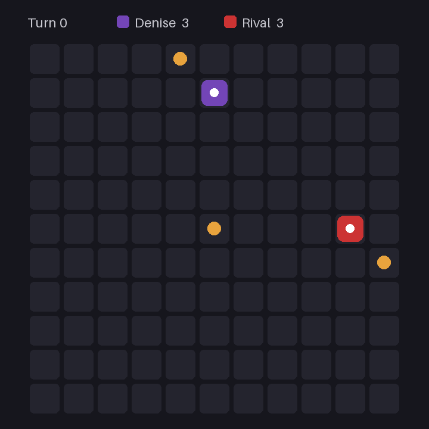

# Deciding Denise



Denise is a Battlesnake. A search engine scores every legal move, then a typed decision model (such as Jev) makes the final pick. It plays standard duels and solo games. Games with three or more snakes are not supported.

## Setup

You'll need Python 3.13 and [uv](https://docs.astral.sh/uv/).

```sh
uv sync
cp .env.example .env
```

Put your API key in `.env`. The server reads `.env` from whatever directory you start it in.

```dotenv
TYPESAFE_API_KEY='your_key'
# TYPESAFE_BASE_URL='https://openrouter.ai/api'
# TYPESAFE_MODEL='typesafe/jev-1.13'
# DEBUG=1
```

## Run

```sh
uv run deciding-denise
```

The snake listens on `http://localhost:8000`. To try it against another snake, use the [Battlesnake CLI](https://github.com/BattlesnakeOfficial/rules):

```sh
battlesnake play -n Denise -u http://localhost:8000 -n Rival -u http://localhost:9000
```

## Test

```sh
uv run pytest
```
